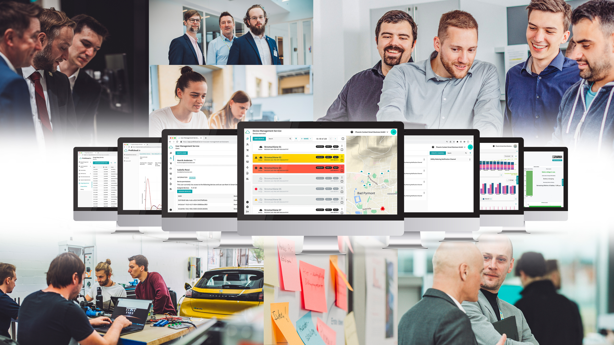

# Hello, this is Phoenix Contaxt Smart Business GmbH

Hi there! We are the centre of excellence at Phoenix Contact for cloud services and data analytics in industrial
automation. We love to create use case-oriented Smart Services to empower small and mid-sized companies to take full
advantage of digitization and Industrial IoT. Our goal: Maximum simplicity, maximum transparency. Our daily business:
Smartification made simple! At Phoenix Contact Smart Business GmbH we develop software services for the entire Phoenix
Contact Group in the fields of development, operations, and sales: Software-as-a-Service. We are a growing team with
currently 22 employees located in Bad Pyrmont and Berlin. Our core competencies: Cloud technology, data analytics,
software services Cloud-based services based on Industrial IoT technologies enable users to gain an overview of the
status of their application – anywhere and at any time. Using various algorithms for forecasting, optimizing, and
controlling, energy management can be made more efficient, system downtime reduced, and system availability increased.
